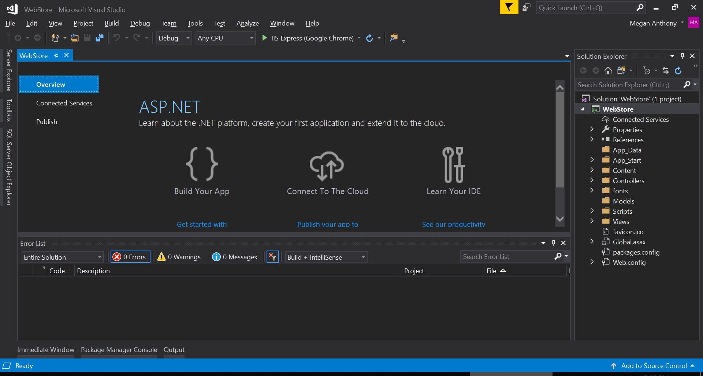
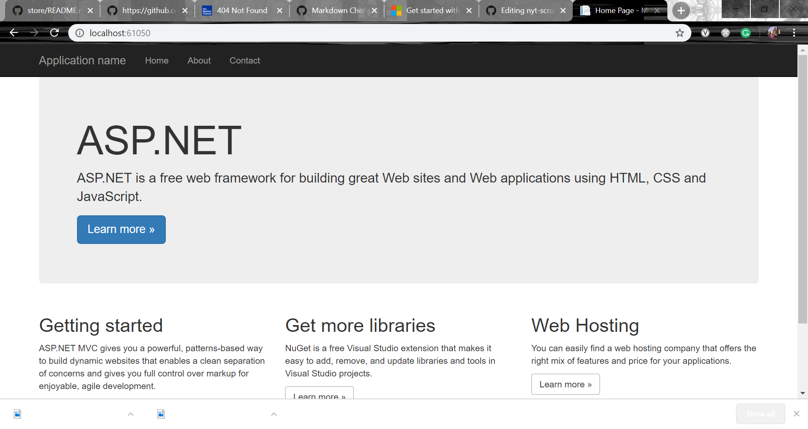
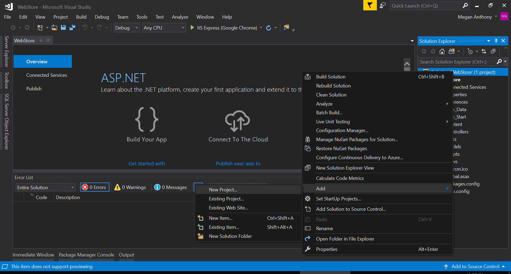
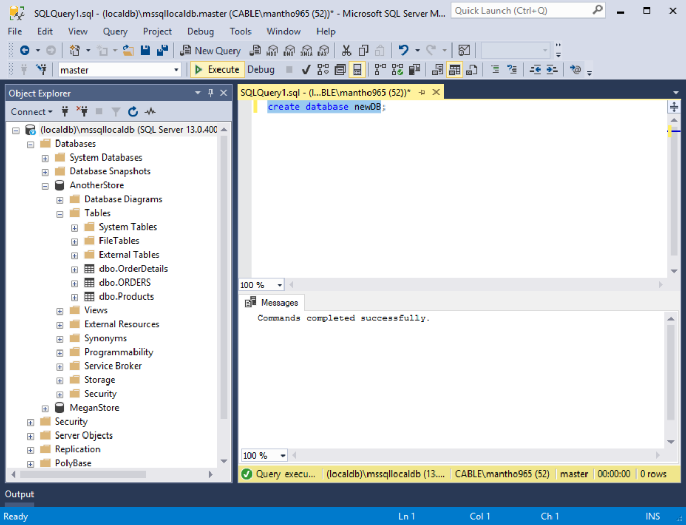
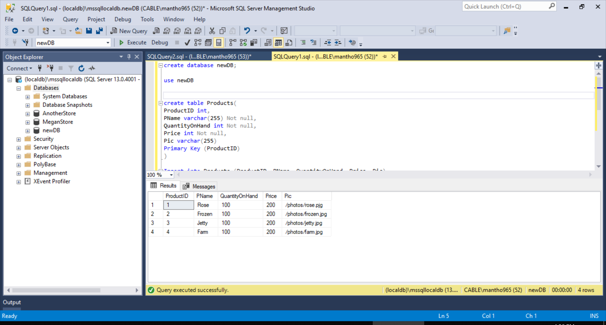
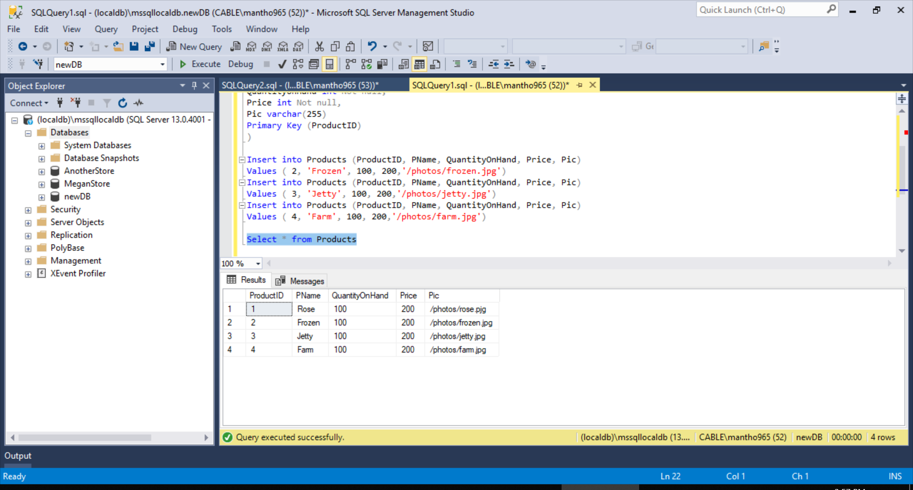
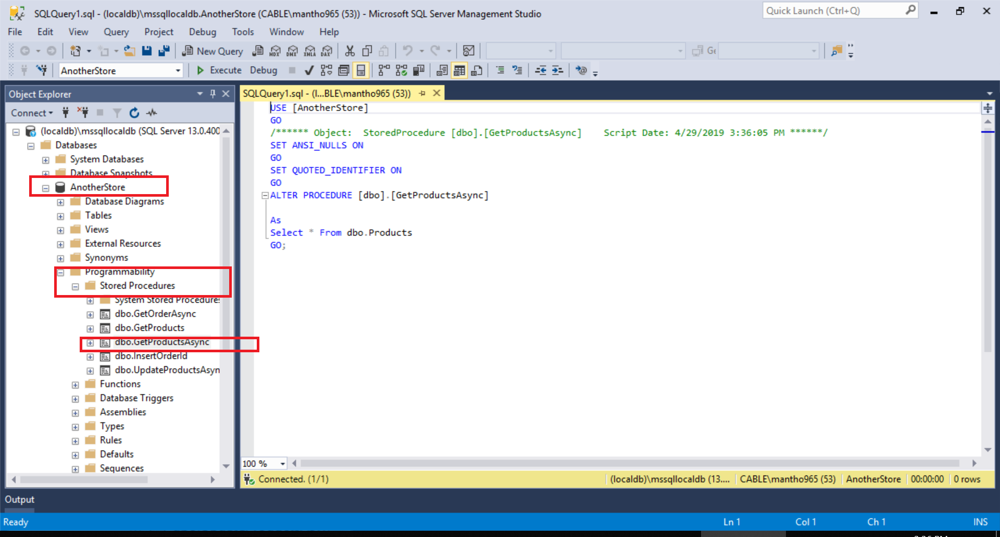
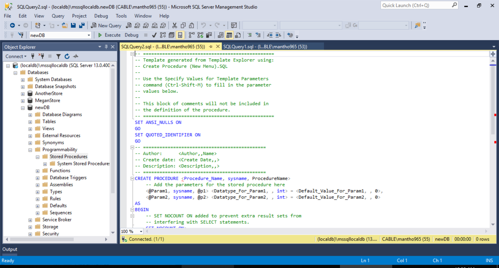
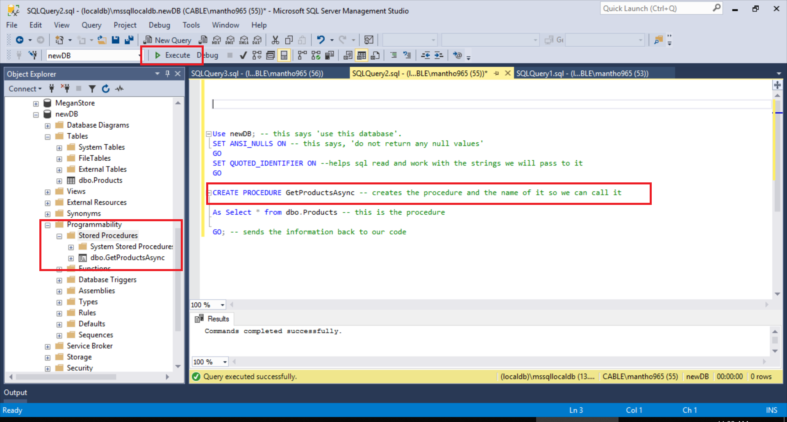
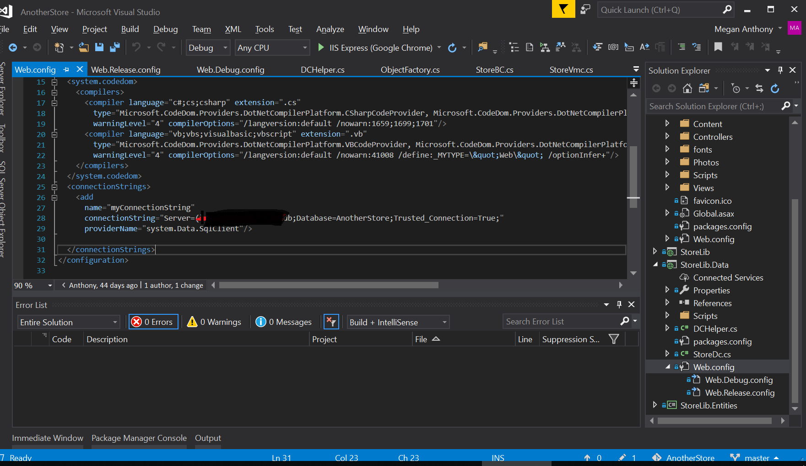

# Online Store - A C# MVC4 Application that connects to SQL Server.
### Also uses jQuery, Knockoutjs and JavaScript

This project is an online photography store. As a new developer, this is the most complex project I have done to date. Thus, if you see anything that may be incorrect please do not hesitate to reach out. I've design this online store to mimic enterprise level applications. By having additional layers, there's more security and loosely coupled features that allow you to fix/change pieces without completely breaking the application.  

### Learning Insights
While building this project I learned some valuable insight into building and designing a C# program. I believe it's crucial to have these tips in the forefront of your mind if you attempt to replicate or build a store similar to this one. If you're an expert in C# or OOP (Object Oriented Programming) please feel free to skip this section. 

1. The first rule I think is important is single responsibility code. Make sure your code doesn't make more than one job. This helps with testing and your fellow developers understand what the code is doing. Single responsibility code is cleaner and easier to maintain. 
2. Organizing your code into projects and libraries. By separating your code into different projects within the application, you'll easily pinpoint what is happening in each layer of your project. This helps to decouple your code so that minor changes will not break the entire project. This project is design to emulate an enterprise level application. There are multiple layers for security and functionality. 
3. Understanding the flow of the application and the corresponding responsibilties. Each layer of this application has a responsiblity. One layer will interact with the Database, another will work with the business logic, another with the view and so on. Understanding the flow between the layers will help you understand what is happen and help with debugging. 
4. The object factory is probably still the hardest concept for me to wrap my mind around. Every object in this application comes from the object factory. The object factory creates the object and the object's interface. The Object registration makes sure that when an object is created it a name and an interface to go with it. And if it is not implemented yet, it will throw an error to remind you to build out this functionality at a later date. The Products in the store use this, every transaction/purhcase uses this, and even the state taxes uses the object factory. If it has properties (and/or methods), it will be created by the object factory. 

### Application Architechure/Flow
This project is an MVC (Model-View-Controller) design that connects to SQL server. It has three distinct layers, and additional layers within it to comply with the enterprise format. The three overarching layers are:
1. Client - composed of the View, the Controller, the View Models, and the View Model Controller (VMCs)
* The View is what is displayed in the browser to the user
* The Controller decides what is shown based on the actions and the URL
* The View Models or VMs are the shape of the objects being displayed. 
2. Business - composed of Entities or POCOs (Plain Old C# Object), and Business Logic, and the Object factory.
* The entities are the shape of the objects being use in this program and the shape the objects will be in the database.
* The business logic is any logic assigned from the business. This can be arbitrary rules, taxes etc.
* The object factory simply creates objects(and their interfaces) to be formed in whatever context they are needed. This is an abstract idea, but it allows the rest of the application to function and pass data to the user from the database and vice versa. 
3. Data - composed of the Data Access Layer and the Database
* The data access layer is the connection to the database. It provides the connection and the commands. It also manipulates the data so that it will comply with SQL commands and terminology. 
* The database includes the tables we need to keep inventory, customer orders and tax information. The data base also has stored procedures created to execute orders and their corresponding tax needs. 

### Starting the Project
Now that we understand the Architecture of the application and the flow, let's start building it!
1. Start Visual Studio - I'm using VS 2017 for this project. 
2. Go to **File** > **New** > **New Project**
3. Select **ASP.NET Web Application (.Net framework) in Visual C#**
4. Name the Project. This one is named, 'AnotherStore'. Save it. 
5. Select MVC framework. *Please feel free to select tests to be added. I will not cover tests but its good practice to include them*

You'll see in the Solution Explorer that some of the architecture of the site is created for you. 

Next we want to make sure the application as is, is working. Click Build on the top navigation bar to build the solution. 
After the immediate window or output tells you the build was successful, or something like this prints out `========== Build: 0 succeeded, 0 failed, 1 up-to-date, 0 skipped ==========` launch the application. Do this by going to Debug and select Start without Debugging. We didn't set any Debugging break points, so starting with Debugging is unnecessary. 
Your browser will launch the site. It should look like this below. Make sure the links work too. Click around and see what's already been built to help you. 

Next we will begin building out our Object Factory in our business layer of the application. First we need to add a new project to this one. In the Solution Explorer, right click on the solution. Then **Add** > **New Project**. Then select **Class Library (.Net framework)** and name it (if you want) StoreLib. 

Next, we need to add the Object Factory Class. Right click on **StoreLib** > **Add** > **Class** then select **Class** and name it, *ObjectFactory.cs*. 
We also need to build our Object Factory Registration. Follow the previous steps to build *ObjectFactory.cs*
So why do we need these two classes and how do they work together? 
The Object Factory Registration creates a strongly typed POCO model for the Object factory. Now, every object coming out of the object factory will follow the Registration model. Thus we are ensuring that every object has a string Name, an Interface and Contrete version.
Please review the code and the comments for this option. 

### Populate the store, but first, SQL
Now that we have our object factory, we can start populating what's in our store. Since I'm somewhat familiar with working in SQL, I was able to setup my server before this project. I also manually entered the data for the products within SQL. If you don't have SQL server set up on your computer, and have not done it before, please ask someone to help you. Its hard to do on your own. [Here's a helpful link from MicroSoft to help you do it](https://docs.microsoft.com/en-us/sql/database-engine/install-windows/install-sql-server?view=sql-server-2017).
Once you have SQL installed, make sure you connect it and create a Database. In this project, I've named my database, 'AnotherStore'. Create this database by opening a new query (click on the new query button). Enter this code `create database AnotherStore` and execute it by highlighting it and clicking the Execute button. If your command is successful, you will see a message in the immediate window. It will say, "Commands Completed Successfully".

#### Create the products table
Use the following picture to make your table in SQL. By setting the Primary Key to the ProductID, that gives SQL the power to create a unique identifer for each product in the store. This is important for when we're updating inventory with each purchase/or when we replenish the store. 
###### Important SQL commands and abbrievations to know for this project
Everything in the store, aside from the image path is listed as **not nul**l. This means that you have to enter a value for the table to accept the incoming object/product. 
**Int** means integer, and 
**varchar(255)** means 'variable characters no longer than 255 characters long'. This means any keyboard character can be use here and the name must be shorter than 255 character length. This usually equates to strings in c#. I like to use this for the image paths and names for the products. Also, saving the image path instead of the image is a good idea. 
Here's what your command should look like. Feel free to name the table and the database to your liking. My database is NewBD, and the table is Products. 

###### Stored Procedures in SQL
Stored Procedures are a very new topic for me. Before starting this project, I only have experience doing basic CRUD (Create, Read, Update, Delete) in SQL and any other database. According to W3schools.com A Stored Procedure is, "A stored procedure is a prepared SQL code that you can save, so the code can be reused over and over again.
So if you have an SQL query that you write over and over again, save it as a stored procedure, and then just call it to execute it.
You can also pass parameters to a stored procedure, so that the stored procedure can act based on the parameter value(s) that is passed."
A stored procedure helps keep your code DRY (Don't repeat yourself). This way, you dont have to code the same sql query again and again. This helps with fixing bugs later. 
This first stored procedure is simple. It creates a table of all of the products that are in the store. 

I highlighted the steps in folders in red that will lead you to where my stored procedures are in this database. 
Once you reach the stored procedure (assuming one is already made in your account. If you right-click on the procedure and click modify, the procedure is visible for you to view and change it. 

Let's recreate this procedure in a new database for practice. 
In SQL, click on the Database > Programmabiltiy > Stored Procedure 
Right click on Stored Procedure and from the dropdown, choose Stored Procedure. In the Query Window, You'll see a template to help you get started building your Stored Procedure. The green is comments to help you understand what's happening. It will look like this picture below. 

In the picture below, I have created the function. It is a simple select all method in SQL. The * means all in sql. Basically, the method says to return all of the not null values from the table. I highlighted the entire prodecure and executed it already. Once I did that, I refreshed my object explorer(the column on the left of the screen) to make sure that my new Stored Procedure is working and saved in the correct place. 

### Connecting the Data Layer to SQL
Now that our inventory is updated in the database, it is time to connect the Data layer to the project. Go back to your project in Visual Studio. Click on the all encompassing project and right-click it to add another project. Make sure it's .Net Framework, so you have a web.config file ready for you to use. Before the closing configuration tag, we're going to add our connection string. In here, you want to specify your database, and the server. If you're unsure what your server name is, you'll see if when you open SQL. Whatever is in the textbox across from server is the server name. 
Here's my config below. I have crossed out the server. The servername and the database information are separated by the semicolon(;).

